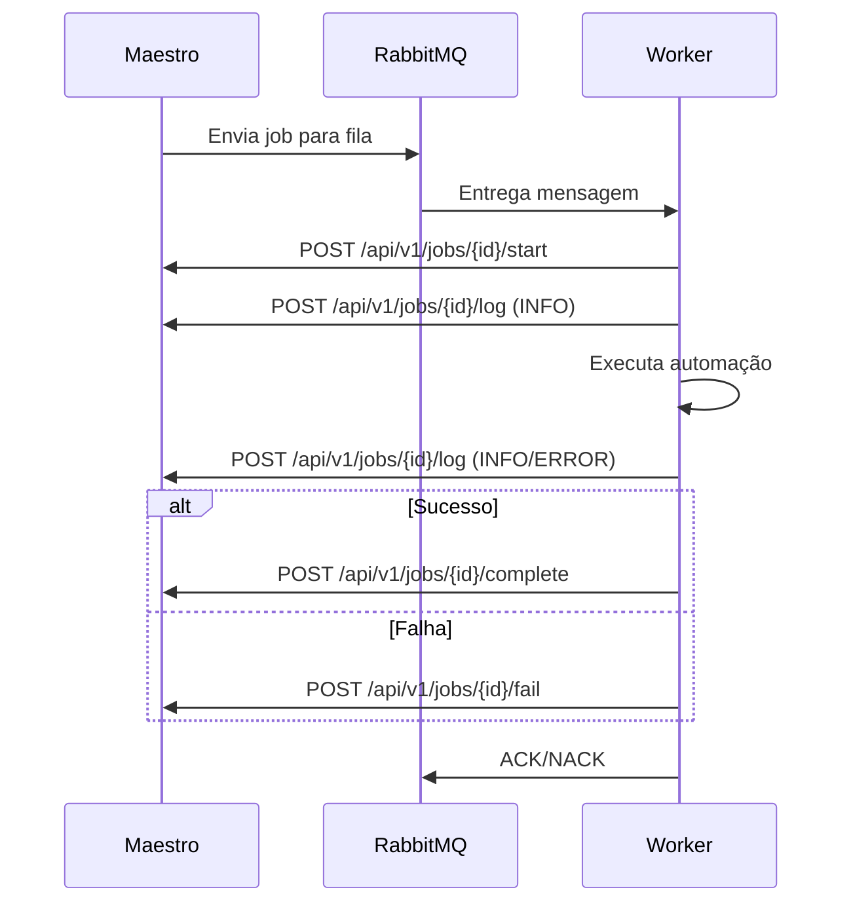

# ✅ Plano de Ação Completo - bot-xml-gms Worker

## Status: CONCLUÍDO

Todas as modificações solicitadas foram implementadas com sucesso.

---

## 📋 Mudanças Implementadas

### ✅ Passo 2.1: Adaptar o Consumo da Mensagem RabbitMQ

**Arquivo:** `worker.py` → função `process_message()`

**Mudanças realizadas:**
- ✅ ID da tarefa alterado de `task_id` para `job_id`
- ✅ Parâmetros agora são extraídos do objeto aninhado `parameters`
- ✅ Validação de campos obrigatórios atualizada para procurar dentro de `params`
- ✅ Logs detalhados adicionados para melhor rastreabilidade

**Código atualizado:**
```python
message = json.loads(body)
job_id = message.get("job_id")  # Mudado de task_id
params = message.get("parameters", {})  # Parâmetros aninhados
```

---

### ✅ Passo 2.2: Substituir as Funções de Reporte de Status

**Arquivo:** `worker.py`

**Mudanças realizadas:**
- ✅ Função `report_status()` REMOVIDA completamente
- ✅ Nova função helper `_make_request()` criada
- ✅ Quatro novas funções de reporte implementadas:

#### 1. `report_status_start(job_id)`
```python
POST /api/v1/jobs/{job_id}/start
```
Reporta início da execução.

#### 2. `report_log(job_id, level, message)`
```python
POST /api/v1/jobs/{job_id}/log
Body: {"level": "INFO|WARNING|ERROR", "message": "texto"}
```
Envia logs em tempo real.

#### 3. `report_status_complete(job_id, result_data)`
```python
POST /api/v1/jobs/{job_id}/complete
Body: {resultado completo da execução}
```
Reporta conclusão bem sucedida.

#### 4. `report_status_fail(job_id, error_data)`
```python
POST /api/v1/jobs/{job_id}/fail
Body: {detalhes do erro}
```
Reporta falha na execução.

---

### ✅ Passo 2.3: Atualizar a Lógica Principal do Worker

**Arquivo:** `worker.py` → função `process_message()`

**Mudanças realizadas:**

#### ✅ Ao receber mensagem:
```python
self.report_status_start(job_id)
self.report_log(job_id, "INFO", "Job iniciado. Preparando execução...")
```

#### ✅ Antes de iniciar bot_runner.run():
```python
self.report_log(job_id, "INFO", f"Processando {len(bot_params['stores'])} loja(s)")
self.report_log(job_id, "INFO", f"Período: {start_date} a {end_date}")
self.report_log(job_id, "INFO", "Iniciando execução da automação...")
```

#### ✅ No caso de sucesso:
```python
if result.get("status") == "completed":
    self.report_log(job_id, "INFO", "Automação concluída com sucesso!")
    self.report_status_complete(job_id, result)

elif result.get("status") == "completed_no_invoices":
    self.report_log(job_id, "INFO", "Automação concluída, porém nenhuma nota fiscal foi encontrada")
    self.report_status_complete(job_id, result)
```

#### ✅ No caso de falha:
```python
else:
    error_msg = result.get("error", "Falha desconhecida na execução")
    self.report_log(job_id, "ERROR", f"Automação falhou: {error_msg}")
    self.report_status_fail(job_id, result)
```

#### ✅ Em exceções:
```python
except json.JSONDecodeError as e:
    self.report_log(job_id, "ERROR", f"Erro ao decodificar JSON: {str(e)}")
    self.report_status_fail(job_id, {...})

except ValueError as e:
    self.report_log(job_id, "ERROR", f"Erro de validação: {str(e)}")
    self.report_status_fail(job_id, {...})

except Exception as e:
    self.report_log(job_id, "ERROR", f"Erro inesperado: {str(e)}")
    self.report_status_fail(job_id, {...})
```

---

## 📊 Formato da Nova Mensagem

### Estrutura Esperada:
```json
{
  "job_id": "uuid-do-job",
  "parameters": {
    "stores": ["Loja 001", "Loja 002"],
    "document_type": "NFe",
    "start_date": "2025-10-01",
    "end_date": "2025-10-27",
    "gms_login_url": "https://gms.example.com/login",
    "headless": true,
    "emitter": "Qualquer",
    "operation_type": "Qualquer",
    "file_type": "XML",
    "invoice_situation": "Qualquer"
  }
}
```

### Campos Obrigatórios:
- ✅ `job_id` (raiz)
- ✅ `parameters.stores`
- ✅ `parameters.document_type`
- ✅ `parameters.start_date`
- ✅ `parameters.end_date`
- ✅ `parameters.gms_login_url`

---

## 🔄 Fluxo de Comunicação



---

## 📁 Arquivos Modificados

1. ✅ `worker.py` - Todas as funções de reporte e lógica de processamento
2. ✅ `INTEGRATION_CHANGES.md` - Documentação detalhada das mudanças
3. ✅ `IMPLEMENTATION_SUMMARY.md` - Este arquivo (resumo executivo)

---

## 🧪 Próximos Passos

### Para Testar:

1. **Reconstruir a imagem Docker:**
   ```bash
   docker-compose build gms-xml-worker
   ```

2. **Iniciar o worker:**
   ```bash
   docker-compose up gms-xml-worker
   ```

3. **Enviar mensagem de teste para RabbitMQ:**
   ```json
   {
     "job_id": "test-job-001",
     "parameters": {
       "stores": ["Loja Teste"],
       "document_type": "NFe",
       "start_date": "2025-10-01",
       "end_date": "2025-10-27",
       "gms_login_url": "https://gms.teste.com/login"
     }
   }
   ```

4. **Verificar logs:**
   - Worker deve reportar início
   - Logs devem aparecer no Maestro
   - Conclusão/falha deve ser reportada

---

## ⚠️ BREAKING CHANGES

**IMPORTANTE:** Esta versão NÃO é compatível com o formato antigo de mensagens.

- ❌ Formato antigo: `task_id` + parâmetros na raiz
- ✅ Formato novo: `job_id` + parâmetros em `parameters`

O Maestro **DEVE** ser atualizado para enviar mensagens no novo formato.

---

## 📚 Documentação Adicional

Para mais detalhes sobre a implementação, consulte:
- `INTEGRATION_CHANGES.md` - Documentação técnica completa
- `worker.py` - Código-fonte com comentários

---

## ✅ Checklist de Implementação

- [x] Adaptar consumo de mensagem RabbitMQ
- [x] Alterar `task_id` para `job_id`
- [x] Extrair parâmetros de objeto aninhado `parameters`
- [x] Remover função `report_status()` antiga
- [x] Criar função helper `_make_request()`
- [x] Implementar `report_status_start()`
- [x] Implementar `report_log()`
- [x] Implementar `report_status_complete()`
- [x] Implementar `report_status_fail()`
- [x] Atualizar lógica de início (chamar start + log)
- [x] Atualizar lógica de sucesso (chamar log + complete)
- [x] Atualizar lógica de falha (chamar log + fail)
- [x] Atualizar tratamento de exceções
- [x] Adicionar logs detalhados
- [x] Documentar mudanças
- [x] Verificar compatibilidade com Docker

---

**Status Final:** ✅ TODAS AS TAREFAS CONCLUÍDAS COM SUCESSO
